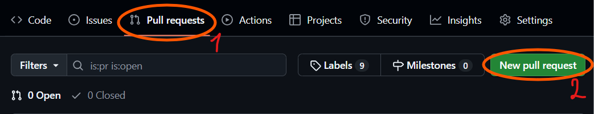
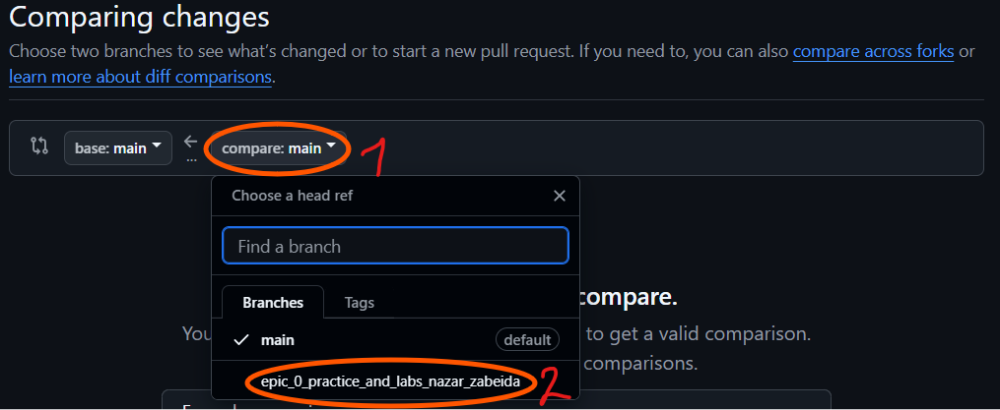
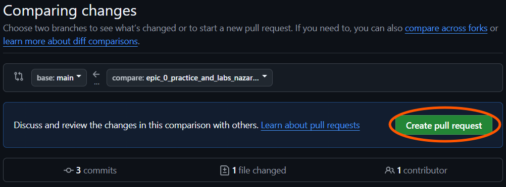

# Epic 1 Task 10
## Lab# Configuration: Create Own Git Repo and Exchange Files with Teammate


1.  Клонуйте репозиторій:
    ```shell
    git clone git@github.com:ZabeidaNazar/testteamrepo.git
    ```

2.  Створіть нову гілку і перейдіть до неї:
    ```shell
    git checkout -b epic_0_practice_and_labs_<ІМ’Я_ПРІЗВИЩЕ>
    ```

3. Додайте у файл main.cpp рядок:
    ```c
    cout << "Hello from <ІМ’Я>!" << endl;
    ```

4. Додайте зміни, які потраплять в наступний коміт:
    ```shell
    git add main.cpp
    ```

5. Зробіть коміт:
    ```shell
    git commit -m "<повідомлення з описом>"
    ```

6. Відправте зміни на github:
    ```shell
    git push -u origin epic_0_practice_and_labs_<ІМ’Я_ПРІЗВИЩЕ>
    ```

7. Створіть pull-request Epic 0 - <ІМ’Я ПРІЗВИЩЕ АНГЛІЙСЬКОЮ>
    
    

    

    
